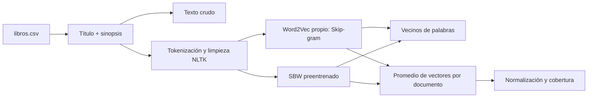

# Trabajo Práctico de Procesamiento del Lenguaje Natural

**Integrantes:** Juan Manuel Ayala, Franco Cerana, Tomás Colombo y Manuel Ibarbia

**Tema:** extracción y representación vectorial de sinopsis de libros

## Índice

- [Resumen](#resumen)
- [Introducción](#introducción)
- [Metodología](#metodología)
- [Desarrollo e implementación](#desarrollo-e-implementación)
- [Resultados y análisis](#resultados-y-análisis)
- [Conclusiones](#conclusiones)
- [Referencias](#referencias)
- [Estructura del repositorio](#estructura-del-repositorio)
- [Instalación y ejecución](#instalación-y-ejecución)

## Resumen

El trabajo construye un corpus de sinopsis de libros de la categoría Drama de Lectulandia y lo utiliza para explorar métodos de procesamiento y representación vectorial de texto. La primera etapa automatiza la recopilación de hasta 150 fichas y almacena título, autores, géneros, serie, sinopsis, URL, categoría y fecha en un CSV. El notebook de la Parte 1 prepara el texto, entrena Word2Vec y utiliza SBERT para búsqueda semántica y evaluación con consultas definidas en `queries.json`. La nueva implementación de la Parte 2 carga el mismo corpus, conserva una versión cruda y prepara otra tokenizada y limpia, y compara un Word2Vec propio con los vectores preentrenados SBW en términos de vecinos para cuatro palabras del dominio. También construye representaciones de documentos promediando vectores de palabras y registra cobertura de vocabulario. Esta entrega de la Parte 2 llega hasta la consigna 4.B. El corpus pequeño, el carácter promocional de las sinopsis, las pérdidas del preprocesamiento y las palabras fuera de vocabulario limitan la interpretación; por eso los vecinos se presentan como exploración cualitativa y no como evidencia de superioridad de un modelo.

## Introducción

El proyecto aborda cómo recuperar información de sinopsis de libros y cómo representar su contenido más allá de la coincidencia literal de palabras. Se parte del trabajo de extracción del TP1 y se amplía con embeddings de palabras y de oraciones. Los objetivos de esta etapa son documentar las decisiones de preprocesamiento, entrenar un Word2Vec sobre el corpus propio, compararlo con un modelo en español preentrenado y explicar las limitaciones de promediar vectores para representar documentos.

## Metodología

El corpus se obtiene de las fichas públicas de la categoría [Drama de Lectulandia](https://ww3.lectulandia.co/genero/drama/). El CSV contiene 150 registros. En los notebooks, el documento de cada libro se construye concatenando título y sinopsis.

La Parte 2 conserva el texto crudo y genera una versión en minúsculas, sin puntuación, números ni stopwords españolas, manteniendo los acentos. Esa versión se utiliza para Word2Vec; se documenta que puede perder negaciones y otras relaciones. El modelo propio usa Skip-gram (`sg=1`), `vector_size=100`, `window=5`, `min_count=2`, semilla 42 y un único worker. Para la comparación se carga `SBW-vectors-300-min5`, con vectores de 300 dimensiones. Los vectores de documento se calculan mediante el promedio de las palabras presentes en cada vocabulario y se normalizan para similitud coseno. Los detalles y justificaciones están en el notebook de la Parte 2.

## Desarrollo e implementación

El desarrollo combina extracción web y dos etapas de análisis en notebooks. El flujo de la Parte 2 es:



### Extracción del corpus

`src/scraper.py` usa Playwright para recorrer páginas de la categoría y visitar fichas; BeautifulSoup selecciona los metadatos y la sinopsis; pandas guarda cada registro en `data/libros.csv`. La extracción evita URLs duplicadas, normaliza espacios y saltos de línea, y controla los campos obligatorios y la cantidad de registros.

### Notebook de la Parte 1

[TP1 — `TP1_ayala_cerana_colombo_ibarbia.ipynb`](notebooks/TP1_ayala_cerana_colombo_ibarbia.ipynb) carga el CSV y prepara dos representaciones: `texto_crudo` y `texto_limpio`. Entrena Word2Vec sobre tokens limpios. Para la búsqueda, codifica el texto crudo con `paraphrase-multilingual-MiniLM-L12-v2`, calcula similitud coseno entre consultas y documentos, y ordena los libros por puntaje. La evaluación toma `queries.json`, compara las predicciones con los identificadores relevantes y calcula Precision@3.

### Notebook de la Parte 2 (hasta 4.B)

[TP2 — `TP2_ayala_cerana_colombo_ibarbia.ipynb`](notebooks/TP2_ayala_cerana_colombo_ibarbia.ipynb) carga y valida los campos del CSV. `texto_crudo` combina título y sinopsis sin normalización destructiva. `tokenizar_y_limpiar` pasa a minúsculas, elimina puntuación, números y stopwords españolas con NLTK, conserva acentos y genera `tokens_limpios`/`texto_limpio`.

El modelo propio se entrena con Gensim `Word2Vec`: Skip-gram (`sg=1`) predice palabras de contexto a partir de una palabra central. Los parámetros son `vector_size=100`, `window=5`, `min_count=2`, `negative=5`, `epochs=100`, `seed=42` y `workers=1`. La semilla y un único worker favorecen reproducibilidad; `min_count=2` descarta términos con una sola ocurrencia.

El modelo preentrenado `SBW-vectors-300-min5` se descarga mediante `gdown` si todavía no existe en `data/modelos/`, y Gensim lo carga como `KeyedVectors` en formato binario. Para cada una de cuatro palabras del dominio, `most_similar` devuelve los cinco vecinos de cada modelo según similitud coseno. Una palabra ausente se informa en la tabla sin detener el notebook.

`vectorizar_documento` promedia los vectores disponibles de los tokens de un libro y normaliza el promedio a norma unitaria. Si no hay tokens conocidos, devuelve un valor ausente. `construir_vectores_documento` aplica esa operación al corpus y calcula cobertura de vocabulario. El promedio produce un vector fijo, pero pierde orden, sintaxis, interacción entre palabras y desambiguación contextual; la limpieza también puede eliminar negaciones.

## Resultados y análisis

| Evidencia | Resultado disponible | Interpretación |
|---|---|---|
| Corpus | 150 registros y ocho columnas: `titulo`, `autores`, `generos`, `serie`, `sinopsis`, `url_libro`, `categoria_origen` y `fecha_extraccion`. | El corpus se limita a la categoría Drama; `generos` admite varias etiquetas por libro. |
| Parte 1 | El notebook define búsqueda SBERT y evaluación Precision@3 con `queries.json`. | La métrica describe el conjunto de consultas y relevancias anotadas, no la calidad universal del buscador. |
| Parte 2 | El notebook genera tablas de vecinos, dimensiones y cobertura de tokens al ejecutarse. | Los modelos tienen corpus y dimensiones distintos; los vecinos permiten una comparación cualitativa, no una comparación directa de coordenadas ni una conclusión de superioridad. |

Las celdas de la Parte 2 no tienen salidas ejecutadas guardadas en el repositorio. Por eso todavía no se informan vecinos observados ni coberturas numéricas como resultados experimentales. Para cumplir plenamente la presentación de resultados de la guía, esos valores deben obtenerse al ejecutar el notebook y luego analizarse con tablas o gráficos y sus limitaciones.

### Estado de los entregables del punto 7

| Entregable | Estado actual |
|---|---|
| Notebook `TP2_apellido1_apellido2.ipynb`, ejecutado y con salidas visibles | El archivo grupal se denomina `TP2_ayala_cerana_colombo_ibarbia.ipynb` y contiene hasta 4.B; falta ejecutarlo y guardar sus salidas. |
| `queries.json` con al menos 10 consultas | Cumplido: el archivo contiene 10 consultas. |
| `informe.pdf` de hasta 3 páginas | Pendiente; no se encuentra en el repositorio. |
| Base de Supabase poblada y accesible | Pendiente; persistencia y tablas pgvector no están implementadas en el alcance actual. |
| Dos familias de embeddings persistidas con HNSW | Pendiente; corresponde a apartados posteriores, junto con SBERT, Postgres y el indexado. |

Las limitaciones previstas son el tamaño del corpus (150 sinopsis), su carácter promocional, la pérdida de negaciones y relaciones por limpieza, y las palabras fuera del vocabulario. Estas condiciones deben considerarse al interpretar cualquier vecino o medida que se obtenga.

## Conclusiones

La Parte 2 implementa la preparación de datos y la comparación de embeddings de palabra hasta la consigna 4.B, manteniendo explícitas las decisiones que pierden información. El promedio ofrece una representación fija y sencilla de cada documento, aunque descarta orden, sintaxis y contexto. Los resultados de vecinos permiten inspeccionar diferencias entre un modelo entrenado con el corpus propio y SBW, pero no bastan para concluir cuál recupera mejor libros relevantes; esa conclusión requiere la evaluación cuantitativa definida en las consignas posteriores.

## Referencias

- Cátedra de Procesamiento del Lenguaje Natural. *Unidad 2: Representación Vectorial de Texto*. Material provisto en `Catedra/Unidad_2_-_Representacin_Vectorial_de_Texto.pdf`.
- Cátedra de Procesamiento del Lenguaje Natural. *Trabajo Práctico N.º 2: Representación vectorial de texto — embeddings y búsqueda semántica*. Enunciado provisto junto al repositorio.
- Cátedra de Procesamiento del Lenguaje Natural. *Presentacion-TPs*. Guía de estructura, estilo y documentación de trabajos prácticos.
- Lectulandia. [Categoría Drama](https://ww3.lectulandia.co/genero/drama/). Fuente de las fichas y sinopsis del corpus.

## Estructura del repositorio

```text
├── README.md
├── requirements.txt
├── src/
│   └── scraper.py
├── data/
│   └── libros.csv
├── notebooks/
│   ├── TP1_ayala_cerana_colombo_ibarbia.ipynb
│   └── TP2_ayala_cerana_colombo_ibarbia.ipynb
├── queries.json
└── docs/
    └── diseno_extraccion.md
```

## Instalación y ejecución

Se requiere Python 3.10 o superior. Desde la raíz del repositorio:

```bash
python -m venv venv
```

Activar el entorno virtual e instalar las dependencias:

```bash
# Windows
venv\Scripts\activate

# Linux o macOS
source venv/bin/activate

pip install -r requirements.txt
```

Para ejecutar el scraper (requiere Internet y Chromium de Playwright):

```bash
python -m playwright install chromium
python src/scraper.py
```

Para abrir los notebooks:

```bash
python -m jupyter lab notebooks/TP1_ayala_cerana_colombo_ibarbia.ipynb
python -m jupyter lab notebooks/TP2_ayala_cerana_colombo_ibarbia.ipynb
```

La Parte 2 puede descargar recursos de NLTK y el archivo SBW preentrenado al ejecutarse. La descarga requiere conexión a Internet y espacio disponible; el modelo se guarda en `data/modelos/` y no forma parte del repositorio.
